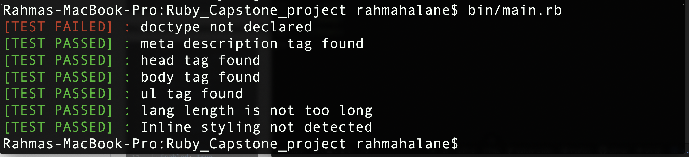
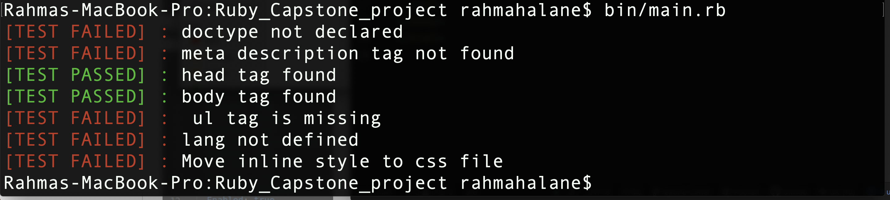

# Ruby-Capstone-Project
# My_Linter
My_Linter is a linter that provides feedback if HTML best practices are not met.

## How it works

The Linter is for beginners who are not familiar with the CSS best practices. There are so many recommended practices for CSS but this linter focus on the basic requirement to have a good CSS syntax.

- The Linter checks if doctype is declared at the beginning of the file.
- It checks if meta tag description is declared.
- It checks if head tag is found.
- It checks if body contents are found.
- It checks if ul tag is found.
- It checks if lang attribute is found and that it is not too long.
- It checks that no elements have an inline style

## Built With

- Ruby.

## Live Video

[ Video Presentation]()

## Getting Started

To get a local copy running follow these simple example steps.

### Prerequisites

- Ruby
- Colorize
- Nokogiri

### Setup

Fork this project to your local machine
Clone the repo on your local machine
Cd into the folder

### How to run the linter in your terminal

Run this command line: bin/main.rb

### Example of Passed Tests with more information

> 

### Example of Failed Tests with more information

> 

## Author

👤 **Rahma Halane**

- Github: [@Imahnama](https://github.com/imahnama)
- Twitter: [@halane_rahma](https://twitter.com/halane_rahma)
- Linkedin: [Rahmahalane](https://linkedin.com/Rahmahalane)

## 🤝 Contributing

Contributions, issues and feature requests are all welcome! Start by:

## Setting Up Project

- Forking the project
- Cloning the project to your local machine
- cd into the project directory
- Run git checkout -b your-branch-name
- Make your contributions
- Push your branch up to your forked repository
- Open a Pull Request with a detailed description to the develop branch of the original project for a review
- Please feel free to contribute to any of these!

Feel free to check the [issues/](https://github.com/imahnama/Ruby-Capstone-Project/issues).

## Show your support

Give a ⭐️ if you like this project!!

## Acknowledgments

- Microverse
- [Adewale Modupe](https://github.com/Eshy10)
- [Ruby Guides](https://www.rubyguides.com/2012/01/parsing-html-in-ruby/)

## 📝 License

No Licence
